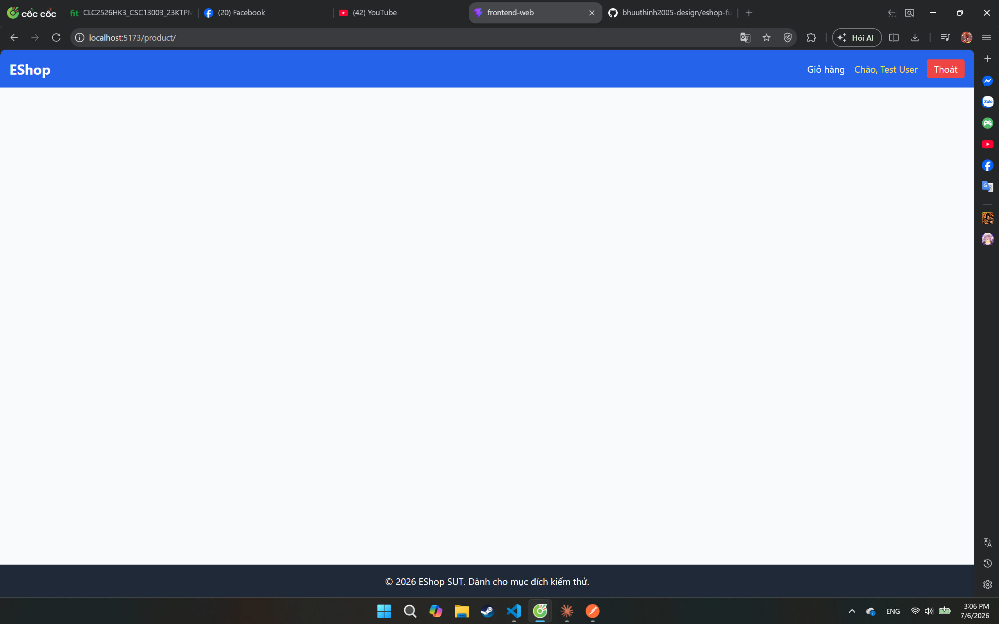

# Bug Report — EShop (HW02 Domain Testing)

> Điền 1 mục cho mỗi bug tìm được. Nhớ đăng đồng thời lên GitHub Issues của nhóm (kèm ảnh chụp màn hình) theo yêu cầu đề bài.

---

## Tổng quan

| # | Feature (FR-xx) | Title | Severity | Trạng thái |
|---|---|---|---|---|
| BUG-01 | FR-06 | Không trả về lỗi khi không truyền id | Minor | Open |
| BUG-02 | | | | |

---

## BUG-01

- **Feature:** FR-06 — Xem chi tiết sản phẩm (Product Detail View)
- **Title:** Không trả về lỗi khi không truyền id (http://localhost:5173/product/)
- **Severity:** Minor
- **Kỹ thuật phát hiện:** Domain Testing
- **Test case liên quan:** TC-A6 
- **Môi trường:** Trình duyệt web

**Steps to reproduce:**
1. Để id rỗng khi gọi `GET /api/products/`

**Input test:**
| Biến | Giá trị |
|---|---|
| id| |

**Expected result:**
> Trả về lỗi

**Actual result:**
> Không trả về lỗi

**Screenshot / Video:**
> 

---

## BUG-02

- **Feature:**
- **Title:**
- **Severity:**
- **Kỹ thuật phát hiện:**
- **Test case liên quan:**
- **Môi trường:**

**Steps to reproduce:**
1.
2.
3.

**Input test:**
| Biến | Giá trị |
|---|---|
| | |

**Expected result:**
>

**Actual result:**
>

**Screenshot / Video:**
>

**GitHub Issue:**

---

## Ví dụ đã điền (tham khảo cách viết)

## BUG-EX

- **Feature:** FR-15 — Quản lý sản phẩm (CRUD)
- **Title:** Hệ thống vẫn tạo được sản phẩm khi giá = 0
- **Severity:** Major
- **Kỹ thuật phát hiện:** Boundary Value Analysis (boundary `price > 0`, giá trị ON = 0)
- **Test case liên quan:** TC-BVA-03
- **Môi trường:** Chrome 126, tài khoản admin@eshop.test

**Steps to reproduce:**
1. Đăng nhập với quyền Admin.
2. Vào trang Quản lý sản phẩm → Thêm sản phẩm mới.
3. Nhập Tên = "Test Product", Giá = 0, Danh mục hợp lệ.
4. Nhấn Lưu.

**Input test:**
| Biến | Giá trị |
|---|---|
| Tên | Test Product |
| Giá | 0 |
| Danh mục | Đồ điện tử |

**Expected result:**
> Hệ thống từ chối và hiển thị thông báo lỗi "Giá phải lớn hơn 0" (theo ràng buộc `price > 0` trong đặc tả).

**Actual result:**
> Sản phẩm được tạo thành công với giá = 0, hiển thị bình thường trên trang danh sách sản phẩm.

**Screenshot / Video:**
> screenshots/bug-ex-price-zero.png

**GitHub Issue:** https://github.com/<org>/eshop-sut/issues/1
