# Bug Report — EShop (HW02 Domain Testing)

> Điền 1 mục cho mỗi bug tìm được. Nhớ đăng đồng thời lên GitHub Issues của nhóm (kèm ảnh chụp màn hình) theo yêu cầu đề bài.

---

## Tổng quan

| # | Feature (FR-xx) | Title | Severity | Trạng thái |
|---|---|---|---|---|
| BUG-01 | FR-06 | Không trả về lỗi khi không truyền id | Minor | Open |
| BUG-02 | FR-06 | Nhấn nút thêm vào giỏ hàng phải double click, nhấn một lần không nhận | Critical | Open |
| BUG-03 | FR-06 | Thêm vào giỏ thành công sản phẩm với số lượng 0 | Critical | Open |
| BUG-04 | FR-06 | Thêm vào giỏ thành công sản phẩm với số lượng -5 | Critical | Open |
| BUG-05 | FR-06 | Nhập số lượng là 1.5 và thêm vào giỏ thành công với số lượng 1 | Critical | Open |
| BUG-06 | FR-06 | Để trống ô số lượng và thêm vào giỏ thành công | Critical | Open |
| BUG-07 | FR-06 | Nhập số lượng là 9999999 và thêm vào giỏ thành công | Major | Open |
| BUG-08 | FR-10 | Admin không thể chuyển trạng thái đơn hàng từ Shipping sang Canceled | Critical | Open |
| BUG-09 | FR-10 | User có thể tự ý hủy đơn hàng đang ở trạng thái Shipping | Critical | Open |
| BUG-10 | FR-14 | Admin có thể tạo danh mục với tên để trống | Critical | Open |
| BUG-11 | FR-14 | Admin có thể tạo danh mục với tên là khoảng trắng | Critical | Open |
| BUG-12 | FR-14 | Admin có thể tạo danh mục khi không có trường name | Critical | Open |
| BUG-13 | FR-14 | Admin có thể tạo danh mục với tên là dạng số | Critical | Open |
| BUG-14 | FR-14 | Admin có thể tạo danh mục với tên bị trùng với danh mục đã có | Critical | Open |
| BUG-15 | FR-14 | User có thể tạo danh mục | Critical | Open |
| BUG-16 | FR-14 | User có thể xóa danh mục | Critical | Open |
| BUG-17 | FR-14 | User có thể cập nhật danh mục | Critical | Open |
| BUG-18 | FR-14 | Khi xóa danh mục chứa sản phẩm, tất cả sản phẩm chuyển sang danh mục có id kế tiếp | Critical | Open |
| BUG-19 | FR-14 | Admin có thể xóa danh mục với id không tồn tại | Minor | Open |
---

## BUG-01

- **Feature:** FR-06 — Xem chi tiết sản phẩm (Product Detail View)
- **Title:** Không trả về lỗi khi không truyền id (http://localhost:5173/product/)
- **Severity:** Minor
- **Kỹ thuật phát hiện:** Domain Testing
- **Test case liên quan:** TC-A6 (FR-06)
- **Môi trường:** Trình duyệt web

**Steps to reproduce:**
1. Để id rỗng khi gọi `GET /api/products/`

**Input test:**
| Biến | Giá trị |
|---|---|
| id| |

**Expected result:**
> Trả về lỗi

**Actual result:**
> Không trả về lỗi

**Screenshot:**
> 

---

## BUG-02

- **Feature:** FR-06 — Xem chi tiết sản phẩm (Product Detail View)
- **Title:** Nhấn nút thêm vào giỏ hàng phải double click, nhấn một lần không nhận
- **Severity:** Critical
- **Kỹ thuật phát hiện:** Domain Testing
- **Test case liên quan:** TC-B1 (FR-06)
- **Môi trường:** Trình duyệt Web

**Steps to reproduce:**
1. Đăng nhập với quyền User Test
2. Nhấn vào trang chi tiết sản phẩm
3. Nhấn nút thêm vào giỏ hàng

**Input test:**
| Biến | Giá trị |
|---|---|
| Nút thêm vào giỏ hàng | |

**Expected result:**
> Nhấn một lần phải thêm ngay

**Actual result:**
> Phải nhấn double-click mới thêm

**Screenshot:**
> 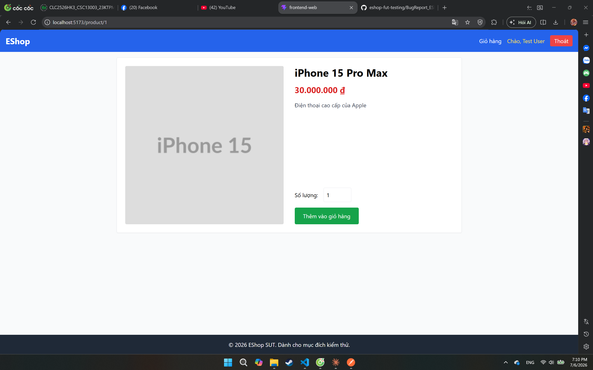

---

## BUG-03

- **Feature:** FR-06 — Xem chi tiết sản phẩm (Product Detail View)
- **Title:** Thêm vào giỏ thành công sản phẩm với số lượng 0
- **Severity:** Critical
- **Kỹ thuật phát hiện:** Domain Testing
- **Test case liên quan:** TC-B2 (FR-06)
- **Môi trường:** Trình duyệt Web

**Steps to reproduce:**
1. Đăng nhập với quyền User Test
2. Nhấn vào trang chi tiết sản phẩm
3. Chọn số lượng là 0
4. Nhấn nút thêm vào giỏ hàng
5. Sản phẩm vẫn được thêm vào giỏ

**Input test:**
| Biến | Giá trị |
|---|---|
| Quantity |0|

**Expected result:**
> Không cho thêm vào giỏ, thông báo lỗi

**Actual result:**
> Sản phẩm được thêm vào giỏ

**Screenshot:**
> 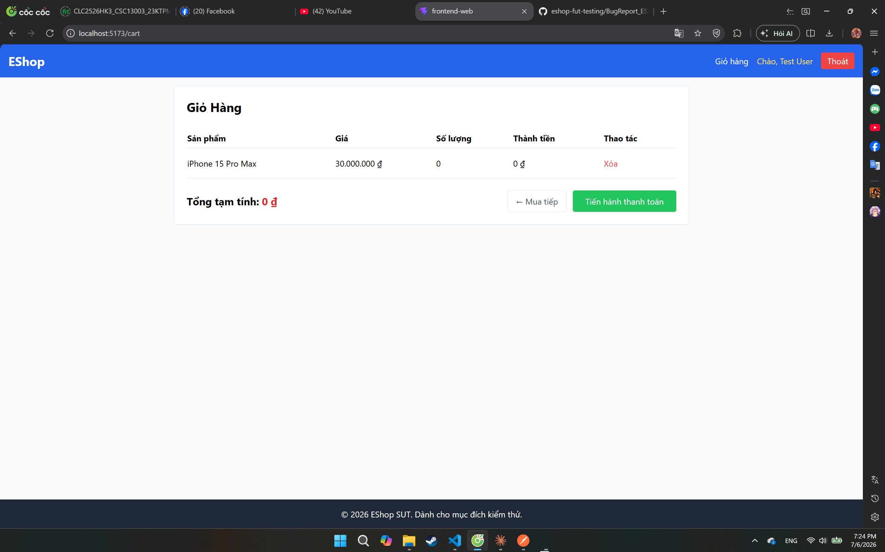

---

## BUG-04

- **Feature:** FR-06 — Xem chi tiết sản phẩm (Product Detail View)
- **Title:** Thêm vào giỏ thành công sản phẩm với số lượng -5
- **Severity:** Critical
- **Kỹ thuật phát hiện:** Domain Testing
- **Test case liên quan:** TC-B2b (FR-06)
- **Môi trường:** Trình duyệt Web

**Steps to reproduce:**
1. Đăng nhập với quyền User Test
2. Nhấn vào trang chi tiết sản phẩm
3. Chọn số lượng là -5
4. Nhấn nút thêm vào giỏ hàng
5. Sản phẩm vẫn được thêm vào giỏ

**Input test:**
| Biến | Giá trị |
|---|---|
| Quantity |-5|

**Expected result:**
> Không cho thêm vào giỏ, thông báo lỗi

**Actual result:**
> Sản phẩm được thêm vào giỏ

**Screenshot:**
> 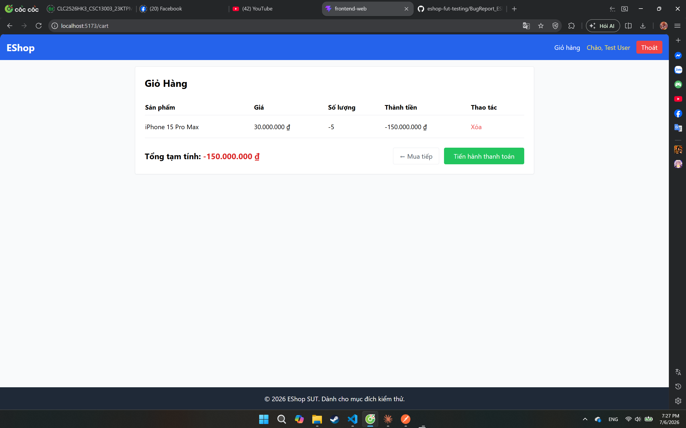

---

## BUG-05

- **Feature:** FR-06 — Xem chi tiết sản phẩm (Product Detail View)
- **Title:** Nhập số lượng là 1.5 và thêm vào giỏ thành công với số lượng 1
- **Severity:** Critical
- **Kỹ thuật phát hiện:** Domain Testing
- **Test case liên quan:** TC-B3 (FR-06)
- **Môi trường:** Trình duyệt Web

**Steps to reproduce:**
1. Đăng nhập với quyền User Test
2. Nhấn vào trang chi tiết sản phẩm
3. Chọn số lượng là 1.5
4. Nhấn nút thêm vào giỏ hàng
5. Sản phẩm vẫn được thêm vào giỏ với quantity là 1

**Input test:**
| Biến | Giá trị |
|---|---|
| Quantity |1.5|

**Expected result:**
> Không cho thêm vào giỏ, thông báo lỗi

**Actual result:**
> Sản phẩm được thêm vào giỏ với quantity là 1

**Screenshot:**
> 
> 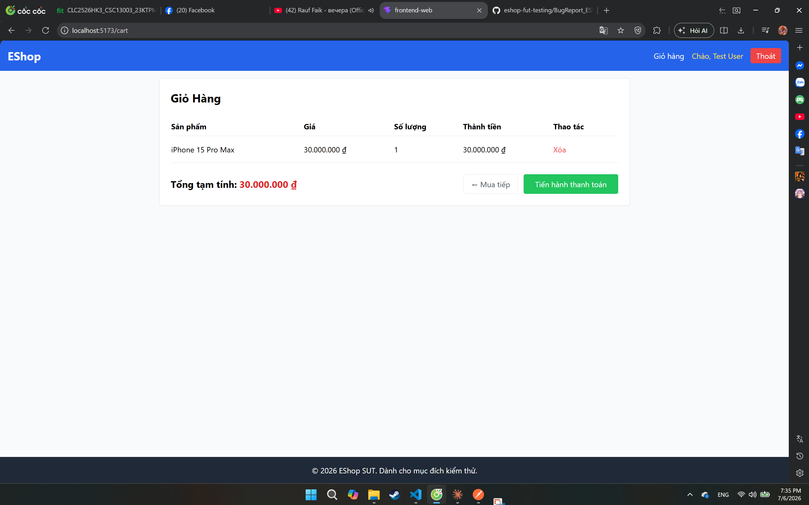

---

## BUG-06

- **Feature:** FR-06 — Xem chi tiết sản phẩm (Product Detail View)
- **Title:**  Để trống ô số lượng và thêm vào giỏ thành công
- **Severity:** Critical
- **Kỹ thuật phát hiện:** Domain Testing
- **Test case liên quan:** TC-B5 (FR-06)
- **Môi trường:** Trình duyệt Web

**Steps to reproduce:**
1. Đăng nhập với quyền User Test
2. Nhấn vào trang chi tiết sản phẩm
3. Để trống ô số lượng
4. Nhấn nút thêm vào giỏ hàng
5. Sản phẩm vẫn được thêm vào giỏ

**Input test:**
| Biến | Giá trị |
|---|---|
| Quantity ||

**Expected result:**
> Không cho thêm vào giỏ, thông báo lỗi

**Actual result:**
> Sản phẩm được thêm vào giỏ

**Screenshot:**
> 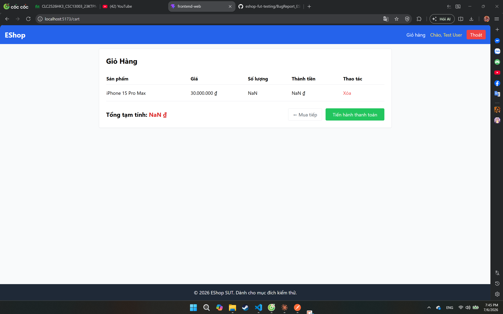

---

## BUG-07

- **Feature:** FR-06 — Xem chi tiết sản phẩm (Product Detail View)
- **Title:**  Nhập số lượng là 9999999 và thêm vào giỏ thành công
- **Severity:** Major
- **Kỹ thuật phát hiện:** Domain Testing
- **Test case liên quan:** TC-B6 (FR-06)
- **Môi trường:** Trình duyệt Web

**Steps to reproduce:**
1. Đăng nhập với quyền User Test
2. Nhấn vào trang chi tiết sản phẩm
3. Nhập số lượng là 9999999
4. Nhấn nút thêm vào giỏ hàng
5. Sản phẩm vẫn được thêm vào giỏ mà không từ chối

**Input test:**
| Biến | Giá trị |
|---|---|
| Quantity |9999999|

**Expected result:**
> Từ chối không cho thêm vào giỏ

**Actual result:**
> Sản phẩm được thêm vào giỏ

**Screenshot:**
> 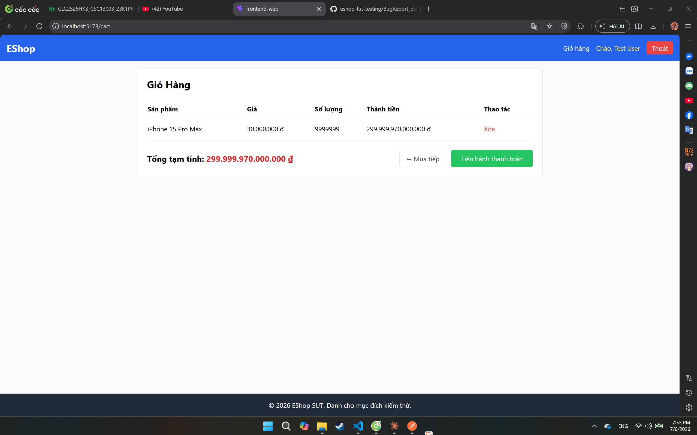

---

## BUG-08

- **Feature:** FR-10: Trạng thái Đơn hàng (Order State Machine)
- **Title:**  Admin không thể chuyển trạng thái đơn hàng từ Shipping sang Canceled 
- **Severity:** Critical
- **Kỹ thuật phát hiện:** Domain Testing
- **Test case liên quan:** TC-A6 (FR-10)
- **Môi trường:** Trình duyệt Web

**Steps to reproduce:**
1. Vào phần mềm Postman
2. POST http://localhost:3000/api/login với body
{
    "email": "admin@eshop.com",
    "password": "Admin123!"
} 
để lấy token
3. PUT http://localhost:3000/api/admin/orders/:id/status với Authorization là Bearer Token vừa nhận, body là {"status": "canceled"}, :id là id của đơn hàng, trạng thái đơn hàng đang là shipping

**Input test:**
| Biến | Giá trị |
|---|---|
|current status |shipping|
|new status |canceled|

**Expected result:**
> 200 OK, order → canceled

**Actual result:**
> 400 — chuyển đổi không hợp lệ

**Screenshot:**
> 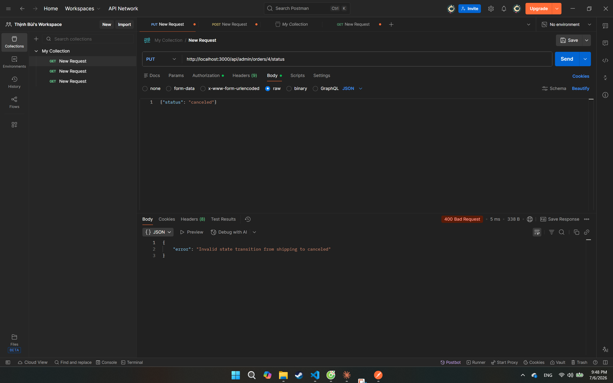

---

## BUG-09

- **Feature:** FR-10: Trạng thái Đơn hàng (Order State Machine)
- **Title:**  User có thể tự ý hủy đơn hàng đang ở trạng thái Shipping 
- **Severity:** Critical
- **Kỹ thuật phát hiện:** Domain Testing
- **Test case liên quan:** TC-B3 (FR-10)
- **Môi trường:** Trình duyệt Web

**Steps to reproduce:**
1. Vào phần mềm Postman
2. POST http://localhost:3000/api/login với body
{
    "email": "test@eshop.com",
    "password": "Test1234!"
} 
để lấy token
3. PUT http://localhost:3000/api/orders/:id/cancel với Authorization là Bearer Token vừa nhận, :id là id của đơn hàng, trạng thái đơn hàng đang là shipping

**Input test:**
| Biến | Giá trị |
|---|---|
|current status |shipping|
|new status |canceled|
**Expected result:**
> 403 (hoặc 400) — User không được tự hủy khi đã shipping 

**Actual result:**
> 200 OK, order → canceled 

**Screenshot:**
> 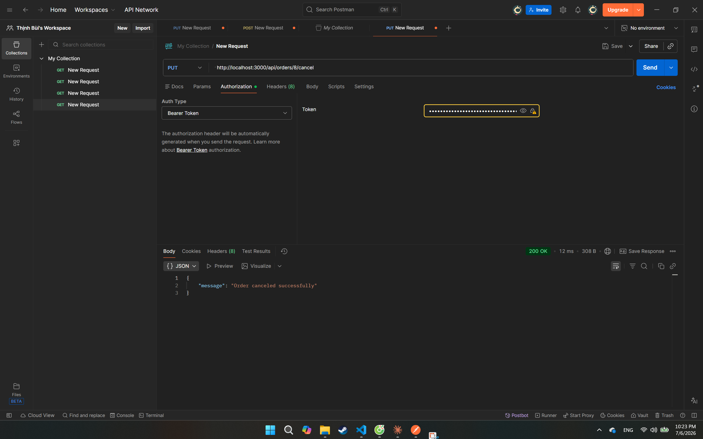

---

## BUG-10

- **Feature:** FR-14: Category management (CRUD)
- **Title:**  Admin có thể tạo danh mục với tên để trống
- **Severity:** Critical
- **Kỹ thuật phát hiện:** Domain Testing
- **Test case liên quan:** TC-A2 (FR-14)
- **Môi trường:** Trình duyệt Web

**Steps to reproduce:**
1. Vào phần mềm Postman
2. POST http://localhost:3000/api/login với body
{
    "email": "admin@eshop.com",
    "password": "Admin123!"
} 
để lấy token
3. POST http://localhost:3000/api/categories với Authorization là Bearer Token vừa nhận, body là {"name": ""}

**Input test:**
| Biến | Giá trị |
|---|---|
|name||
**Expected result:**
> 400 — "Tên danh mục không được để trống"

**Actual result:**
> 200 OK, danh mục được tạo

**Screenshot:**
> 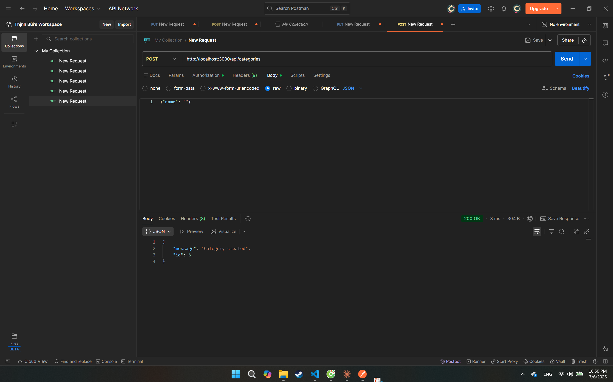

---

## BUG-11

- **Feature:** FR-14: Category management (CRUD)
- **Title:**  Admin có thể tạo danh mục với tên là khoảng trắng
- **Severity:** Critical
- **Kỹ thuật phát hiện:** Domain Testing
- **Test case liên quan:** TC-A3 (FR-14)
- **Môi trường:** Trình duyệt Web

**Steps to reproduce:**
1. Vào phần mềm Postman
2. POST http://localhost:3000/api/login với body
{
    "email": "admin@eshop.com",
    "password": "Admin123!"
} 
để lấy token
3. POST http://localhost:3000/api/categories với Authorization là Bearer Token vừa nhận, body là {"name": "   "}

**Input test:**
| Biến | Giá trị |
|---|---|
|name|   |
**Expected result:**
> 400 (kỳ vọng) — hệ thống nên trim và coi là rỗng 

**Actual result:**
> 200 OK, danh mục được tạo

**Screenshot:**
> 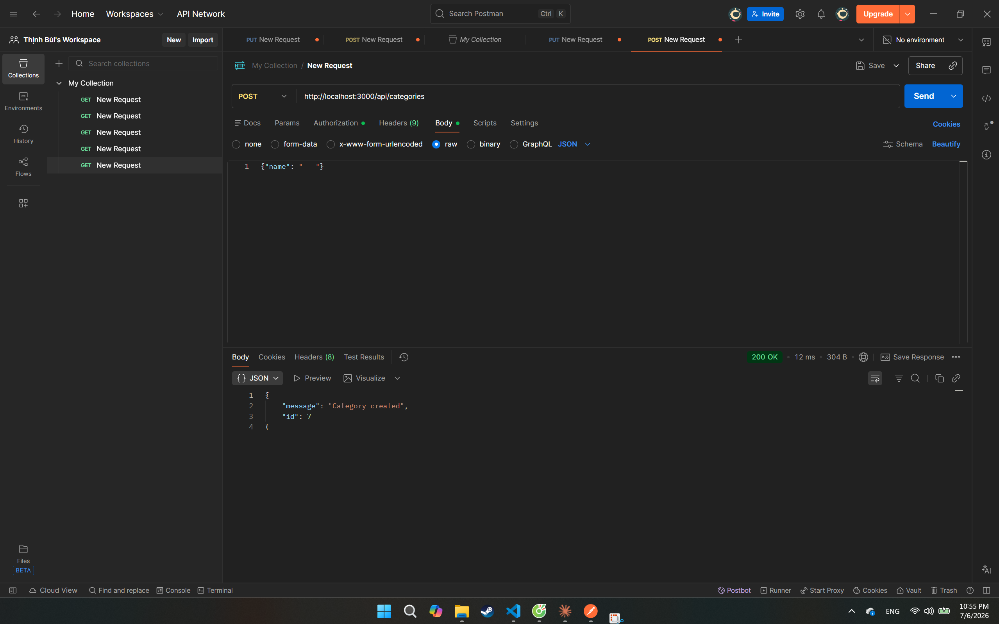

---

## BUG-12

- **Feature:** FR-14: Category management (CRUD)
- **Title:**  Admin có thể tạo danh mục khi không có trường name
- **Severity:** Critical
- **Kỹ thuật phát hiện:** Domain Testing
- **Test case liên quan:** TC-A4 (FR-14)
- **Môi trường:** Trình duyệt Web

**Steps to reproduce:**
1. Vào phần mềm Postman
2. POST http://localhost:3000/api/login với body
{
    "email": "admin@eshop.com",
    "password": "Admin123!"
} 
để lấy token
3. POST http://localhost:3000/api/categories với Authorization là Bearer Token vừa nhận, body là {"lol": "do an"}

**Input test:**
| Biến | Giá trị |
|---|---|
|lol|do an|
**Expected result:**
> 400 — thiếu trường bắt buộc

**Actual result:**
> 200 OK, danh mục được tạo

**Screenshot:**
> 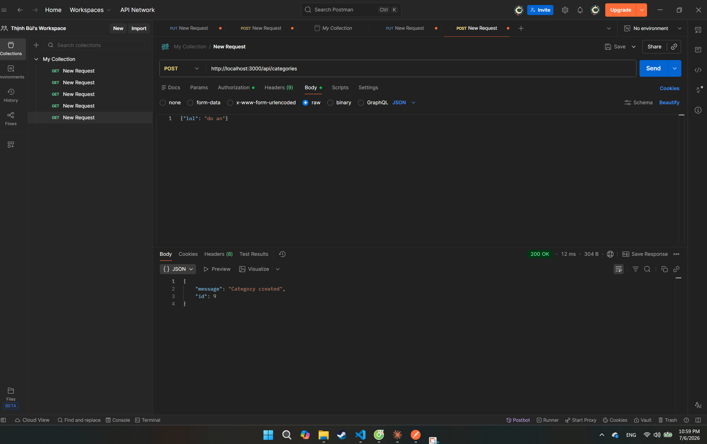

---

## BUG-13

- **Feature:** FR-14: Category management (CRUD)
- **Title:**  Admin có thể tạo danh mục với tên là dạng số
- **Severity:** Critical
- **Kỹ thuật phát hiện:** Domain Testing
- **Test case liên quan:** TC-A5 (FR-14)
- **Môi trường:** Trình duyệt Web

**Steps to reproduce:**
1. Vào phần mềm Postman
2. POST http://localhost:3000/api/login với body
{
    "email": "admin@eshop.com",
    "password": "Admin123!"
} 
để lấy token
3. POST http://localhost:3000/api/categories với Authorization là Bearer Token vừa nhận, body là {"name": 123}

**Input test:**
| Biến | Giá trị |
|---|---|
|name|123|
**Expected result:**
> 400 hoặc tự động ép kiểu — cần quan sát thực tế

**Actual result:**
> 200 OK, danh mục được tạo

**Screenshot:**
> 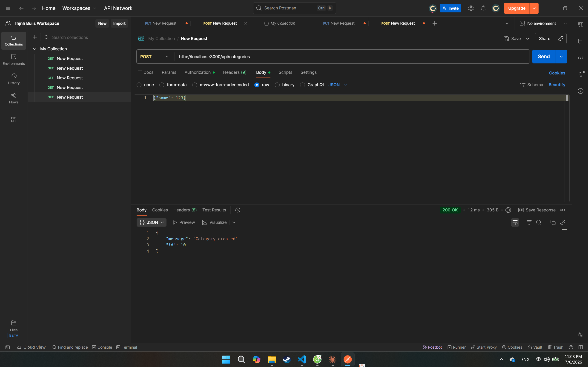

---

## BUG-14

- **Feature:** FR-14: Category management (CRUD)
- **Title:**  Admin có thể tạo danh mục với tên bị trùng với danh mục đã có
- **Severity:** Critical
- **Kỹ thuật phát hiện:** Domain Testing
- **Test case liên quan:** TC-A6 (FR-14)
- **Môi trường:** Trình duyệt Web

**Steps to reproduce:**
1. Vào phần mềm Postman
2. POST http://localhost:3000/api/login với body
{
    "email": "admin@eshop.com",
    "password": "Admin123!"
} 
để lấy token
3. POST http://localhost:3000/api/categories với Authorization là Bearer Token vừa nhận, body là {"name": "Điện thoại"}

**Input test:**
| Biến | Giá trị |
|---|---|
|name|Điện thoại|
**Expected result:**
> Không xác định trước

**Actual result:**
> 200 OK, danh mục được tạo

**Screenshot:**
> 

---

## BUG-15

- **Feature:** FR-14: Category management (CRUD)
- **Title:**  User có thể tạo danh mục
- **Severity:** Critical
- **Kỹ thuật phát hiện:** Domain Testing
- **Test case liên quan:** TC-B2 (FR-14)
- **Môi trường:** Trình duyệt Web

**Steps to reproduce:**
1. Vào phần mềm Postman
2. POST http://localhost:3000/api/login với body
{
    "email": "test@eshop.com",
    "password": "Test123!"
} 
để lấy token
3. POST http://localhost:3000/api/categories với Authorization là Bearer Token vừa nhận, body là {"name": "kkk"}

**Input test:**
| Biến | Giá trị |
|---|---|
|name|kkk|
**Expected result:**
> 403 Forbidden

**Actual result:**
> 200 OK, danh mục được tạo

**Screenshot:**
> 

---

## BUG-16

- **Feature:** FR-14: Category management (CRUD)
- **Title:**  User có thể xóa danh mục
- **Severity:** Critical
- **Kỹ thuật phát hiện:** Domain Testing
- **Test case liên quan:** TC-B5 (FR-14)
- **Môi trường:** Trình duyệt Web

**Steps to reproduce:**
1. Vào phần mềm Postman
2. POST http://localhost:3000/api/login với body
{
    "email": "test@eshop.com",
    "password": "Test123!"
} 
để lấy token
3. DELETE http://localhost:3000/api/categories/:id với Authorization là Bearer Token vừa nhận

**Input test:**
| Biến | Giá trị |
|---|---|
|||
**Expected result:**
> 403 Forbidden

**Actual result:**
> 200 OK

**Screenshot:**
> 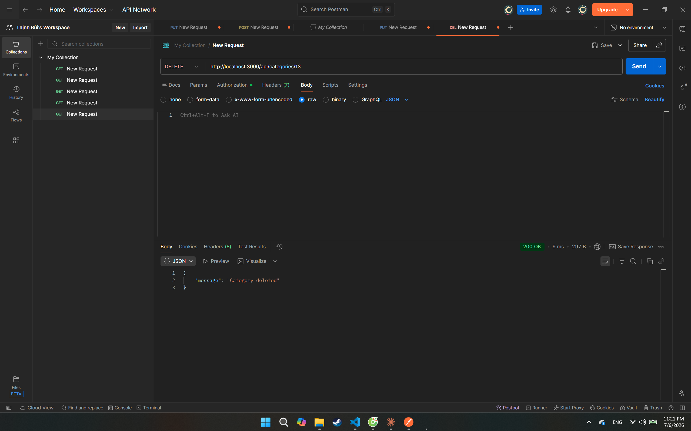

---

## BUG-17

- **Feature:** FR-14: Category management (CRUD)
- **Title:**  User có thể cập nhật danh mục
- **Severity:** Critical
- **Kỹ thuật phát hiện:** Domain Testing
- **Test case liên quan:** TC-B6 (FR-14)
- **Môi trường:** Trình duyệt Web

**Steps to reproduce:**
1. Vào phần mềm Postman
2. POST http://localhost:3000/api/login với body
{
    "email": "test@eshop.com",
    "password": "Test123!"
} 
để lấy token
3. PUT http://localhost:3000/api/categories/:id với Authorization là Bearer Token vừa nhận, body là {"name": "Máy tính"}

**Input test:**
| Biến | Giá trị |
|---|---|
|name|Máy tính|
**Expected result:**
> 403 Forbidden

**Actual result:**
> 200 OK

**Screenshot:**
> 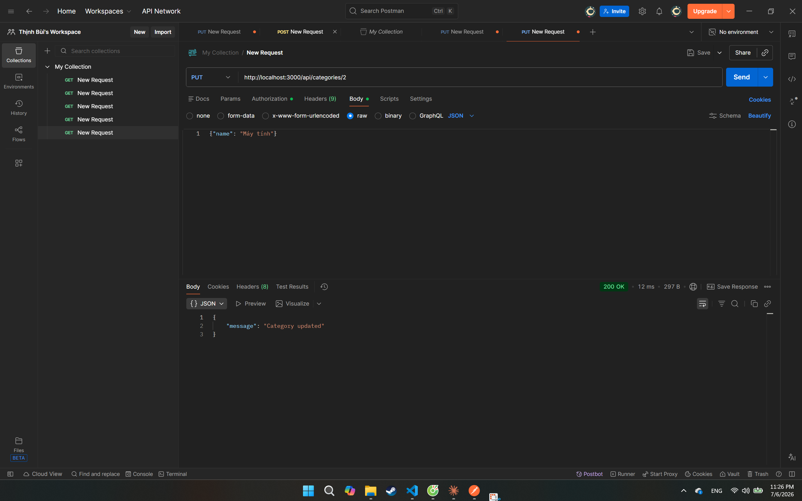

---

## BUG-18

- **Feature:** FR-14: Category management (CRUD)
- **Title:**  Khi xóa danh mục chứa sản phẩm, tất cả sản phẩm chuyển sang danh mục có id kế tiếp
- **Severity:** Critical
- **Kỹ thuật phát hiện:** Domain Testing
- **Test case liên quan:** TC-C2 (FR-14)
- **Môi trường:** Trình duyệt Web

**Steps to reproduce:**
1. Vào phần mềm Postman
2. POST http://localhost:3000/api/login với body
{
    "email": "admint@eshop.com",
    "password": "Admin123!"
} 
để lấy token
3. DELETE http://localhost:3000/api/categories/:id với Authorization là Bearer Token vừa nhận, id của danh mục có chứa sản phẩm

**Input test:**
| Biến | Giá trị |
|---|---|
|id|1|
**Expected result:**
> Cần quan sát hành vi thực tế (chặn xóa / xóa và để sản phẩm mồ côi / lỗi 500)

**Actual result:**
> 200 OK, sản phẩm chuyển sang của danh mục có id là 2

**Screenshot:**
> 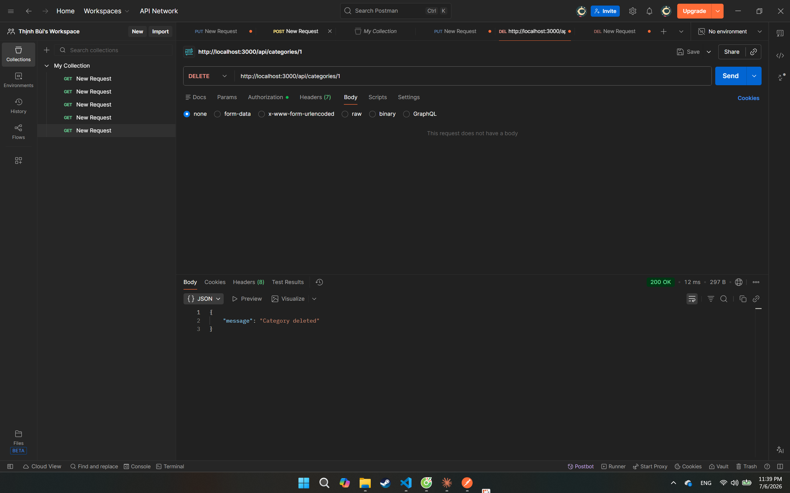

---

## BUG-19

- **Feature:** FR-14: Category management (CRUD)
- **Title:**  Admin có thể xóa danh mục với id không tồn tại
- **Severity:** Minor
- **Kỹ thuật phát hiện:** Domain Testing
- **Test case liên quan:** TC-C2 (FR-14)
- **Môi trường:** Trình duyệt Web

**Steps to reproduce:**
1. Vào phần mềm Postman
2. POST http://localhost:3000/api/login với body
{
    "email": "admint@eshop.com",
    "password": "Admin123!"
} 
để lấy token
3. DELETE http://localhost:3000/api/categories/:id với Authorization là Bearer Token vừa nhận, id không tồn tại

**Input test:**
| Biến | Giá trị |
|---|---|
|id|999999|
**Expected result:**
>  404 Not Found 

**Actual result:**
> 200 OK

**Screenshot:**
> 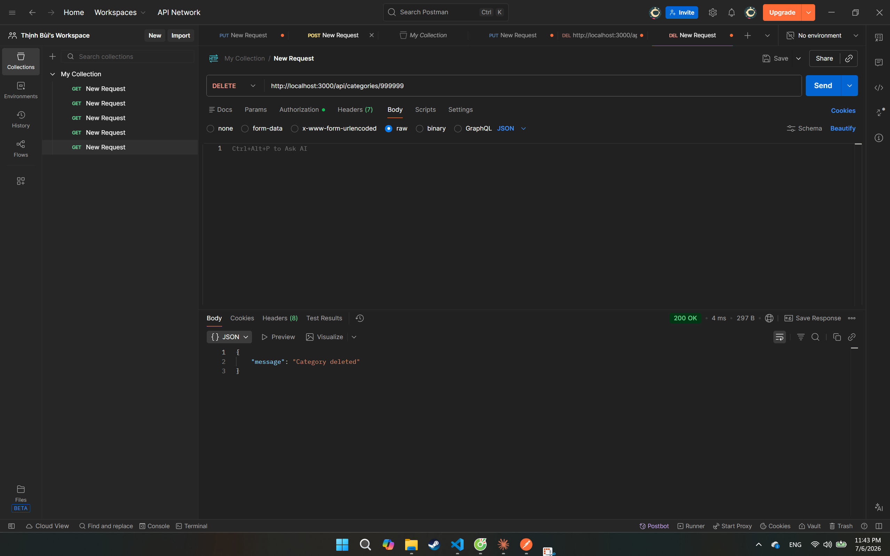

---